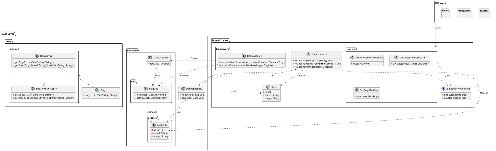

# Proyecto: Dog API Clean Architecture IES Virgen del Carmen, Jaén 23/24

Este repositorio contiene la implementación de una aplicación basada en **Clean Architecture** para gestionar información sobre perros. Se han utilizado diferentes capas y principios de arquitectura limpia para mantener la separación de responsabilidades.

## 🚀 Descripción
La idea de esta rama, es ver una separación clara entre nuestro domain y la data. Para ello, he planteado un modelo de dominio genérico, llamado DogModel y desde cada uno de las data su propio modelo.
Hay que recordar que en la rama main, teníamos una representación sólo con datos desde memoria, en el que simulábamos un acceso a algún repositorio remoto por medio de un Service y el tipo de dato Pair, es el 
que nos devolvía dicho servicio. Para entenderlo, hay que imaginarnos una relación entre un Pair y un registro por ejemplo de una BBDD. En la versión inicial, el repositorio devolvía los datos en forma de Dog, considerado
como un modelo del dominio.

En este caso, al tener dos fuentes de datos bien diferenciados, necesitamos un modelo común en el dominio y unas funciones de extensión que realicen los respectivos mapeos. El repositorio, mantendrá los mismos
métodos de acceso a datos utilizados en el repositorio del #main.

### 🗂 Cambios a realizar para prácticar con Room
Sería muy interesante, trabajar con un crud en la BBDD, como insertar, eliminar y editar. Así podríamos trabajar con el crud desde la BBDD, borrar la BBDD y ver como se vuelven a coger los datos de forma nativa en memoria.

### Modelos en la data:
`data\mem\Pair<String><String>`: Modelo de datos de la data simulando un acceso a datos nativos.
`data\database\DogEntity`: Modelo de datos de Room


## 📌 Arquitectura
El diagrama de clases se ha generado utilizando **PlantUML** y representa la estructura del proyecto:





## 📂 Capas de la Arquitectura

### 🗂 Data Layer
- `mem`: Contiene modelos de datos, servicios y el repositorio de objetos.
- `database`: Implementa la persistencia con Room e incluye DAOs y entidades.
- `DogRepository`: Implementa la interfaz del repositorio para conectar con la capa de dominio.

### 📌 Domain Layer
- `Dog`: Modelo de datos de la aplicación.
- `DogRepositoryInterface`: Interfaz del repositorio.
- `DogExtension`: Métodos de extensión para transformar entidades.
- `usecase`: Casos de uso principales.

### 🎨 UI Layer
- `adapter`: Adaptadores para la presentación.
- `modelview`: Implementación del patrón MVVM.
- `views`: Componentes de interfaz gráfica.

## 🚀 Instalación y Uso
1. Clona el repositorio:
   ```sh
   git clone https://github.com/tu-usuario/dogApi-clean.git
   ```
2. Abre el proyecto en tu IDE favorito.
3. Asegúrate de que tienes configurada la base de datos Room.
4. Ejecuta la aplicación y disfruta.

## 📌 Contribuciones
¡Cualquier contribución es bienvenida! Siéntete libre de hacer un `fork` y enviar un `pull request`.

## 📜 Propietario
Este proyecto ha sido desarrollado por **Santiago Rodenas Herráiz**, profesor de **2DAM Programación Multimedia**, especializado en los módulos de **Programación de Dispositivos Móviles** y **Programación de Servicios y Procesos**.

## 📜 Licencia
Este proyecto está bajo la licencia MIT. ¡Disfrútalo y úsalo libremente!
